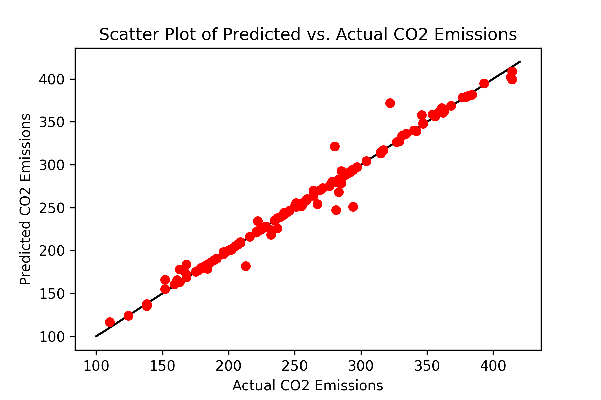

# CO2 Emission Prediction

This repository contains a Jupyter Notebook that demonstrates the prediction of CO2 emissions based on vehicle characteristics using various machine learning techniques. The project utilizes a RandomForestRegressor and is fine-tuned through GridSearchCV to achieve the best prediction results. Additionally, SHAP values are computed to interpret the model's predictions.

## Dataset

The dataset used in this project is the `FuelConsumption.csv`, which contains model-specific fuel consumption ratings and estimated carbon dioxide emissions for new light-duty vehicles for retail sale in Canada. You can download the dataset directly from [IBM Cloud](https://open.canada.ca/data/en/dataset/98f1a129-f628-4ce4-b24d-6f16bf24dd64?utm_medium=Exinfluencer&utm_source=Exinfluencer&utm_content=000026UJ&utm_term=10006555&utm_id=NA-SkillsNetwork-Channel-SkillsNetworkCoursesIBMDeveloperSkillsNetworkML0101ENSkillsNetwork20718538-2021-01-01).

## Features

The dataset includes features like:
- `MAKE`: Manufacturer of the vehicle
- `MODEL`: Model of the vehicle
- `VEHICLE CLASS`: Vehicle class
- `ENGINE SIZE`: Engine size in liters
- `CYLINDERS`: Number of cylinders
- `TRANSMISSION`: Type of transmission
- `FUEL TYPE`: Type of fuel
- `FUEL CONSUMPTION in CITY(L/100 km)`: Fuel consumption in city
- `FUEL CONSUMPTION in HWY (L/100 km)`: Fuel consumption on highway
- `FUEL CONSUMPTION COMB (L/100 km)`: Combined fuel consumption
- `CO2 EMISSIONS`: CO2 emissions in grams per km

## Installation

To run this notebook, you'll need to install the necessary Python libraries. You can install the dependencies using the following command:

```bash
pip install numpy pandas matplotlib scikit-learn shap
```

## Downloading the Dataset

To download the dataset directly into the directory where you plan to run the notebook, use the following command:

```bash
wget -O FuelConsumption.csv https://cf-courses-data.s3.us.cloud-object-storage.appdomain.cloud/IBMDeveloperSkillsNetwork-ML0101EN-SkillsNetwork/labs/Module%202/data/FuelConsumptionCo2.csv
```

## Data Preprocessing
The dataset is preprocessed to remove irrelevant columns and shuffle the data for randomness. The preprocessed data is then split into training and testing sets, and features and the target variable are separated.

```python
# Import necessary libraries
import numpy as np
import pandas as pd
import matplotlib.pyplot as plt
import shap
from sklearn.model_selection import train_test_split, GridSearchCV
from sklearn.ensemble import RandomForestRegressor
from sklearn.metrics import r2_score
from sklearn.pipeline import Pipeline
from sklearn.preprocessing import MinMaxScaler

# Load the dataset
df = pd.read_csv("FuelConsumption.csv")

# Display the first few rows of the dataframe to understand its structure
print(df.head())

# Display all columns to understand what columns are available
print(df.columns)

# Define the target variable
target_var = 'CO2EMISSIONS'

# Drop irrelevant columns
df_new = df.drop(['MAKE','MODEL','VEHICLECLASS','TRANSMISSION','FUELTYPE'], axis=1)

Shuffle the dataset
data = df_new.sample(frac=1, random_state=42)

# Split the data into training and testing sets
train_set, test_set = train_test_split(data, test_size=0.15, random_state=42)

# Separate features and target variable for both training and testing sets
X_trainset = train_set.drop(columns=target_var)
Y_trainset = train_set[target_var]
X_testset = test_set.drop(columns=target_var)
Y_testset = test_set[target_var]
```

## Model Building and Evaluation
A RandomForestRegressor model is built and tuned using GridSearchCV with a detailed set of hyperparameters. The model is then evaluated on both the training and test datasets.

```python
# Initialize and configure the RandomForestRegressor model
model = RandomForestRegressor(oob_score=True, random_state=42)

# Define the hyperparameters for grid search
parameters = {
    'n_estimators': range(150, 601, 50),
    'max_features': ["auto"],
    'min_samples_leaf': [2, 3],
    'min_samples_split': [2, 3]
}

# Initialize GridSearchCV with the RandomForest model and the defined parameters
clf = GridSearchCV(model, parameters, cv=10, verbose=2, n_jobs=-1, scoring='neg_mean_squared_error')

# Fit the model to the training set
clf.fit(X_trainset, Y_trainset)
```

## Results and Visualization
The best model's parameters and its performance metrics are displayed, and predictions are plotted against actual values for visual assessment.

```python
# Print the best parameters found by GridSearchCV
print("Best parameters found: ", clf.best_params_)

# Retrieve the best model from the grid search
model = clf.best_estimator_

# Evaluate the model using the training and test sets
print("R^2 Training Score: {:.2f}".format(model.score(X_trainset, Y_trainset)))
print("R^2 Validation Score: {:.2f}".format(model.score(X_testset, Y_testset)))
print("OOB Score: {:.2f}".format(model.oob_score_))

# Predict the CO2 emissions on the test set
y_pred = model.predict(X_testset)

# Plot the true values vs the predicted values
plt.figure(figsize=(10, 6))
plt.plot(Y_testset, y_pred, 'ro')
plt.plot([Y_testset.min(), Y_testset.max()], [Y_testset.min(), Y_testset.max()], 'k--')
plt.xlabel('Actual CO2 Emissions')
plt.ylabel('Predicted CO2 Emissions')
plt.title('Scatter Plot of Predicted vs. Actual CO2 Emissions')
plt.savefig('prediction_accuracy.png', dpi=300)  # Save the plot with a high resolution
plt.show()
```

## Model Results

Here are the results of our model predictions compared to the actual data:



This scatter plot shows how closely our model's predictions align with the actual emissions data.

## SHAP Value Interpretation
SHAP values are computed to interpret the influence of each feature on the model's predictions.

```python
# Explain the model's predictions using SHAP values
explainer = shap.Explainer(model, X_trainset)
shap_values = explainer.shap_values(X_trainset)

# Plot the SHAP values for the training set
shap.summary_plot(shap_values)
plt.savefig('shap_summary_plot.png', dpi=300)
plt.show()

# Additional SHAP plot (violin plot)
shap.summary_plot(shap_values, X_trainset, plot_type='violin')
plt.savefig('shap_violin_plot.png', dpi=300)
plt.show()
```

## Contributions
Contributions are welcome! Feel free to fork this repository and submit your improvements via pull requests.


